# Sistema de Ventas

Modern point-of-sale (POS) and sales management system built with React 19, TypeScript, and
Supabase.

## 🚀 Features

- **Point of Sale (POS)** - Fast and intuitive sales interface
- **Product Management** - Complete CRUD operations for products and categories
- **Inventory Control** - Multi-warehouse and multi-branch inventory tracking
- **Sales Reporting** - Advanced analytics and charts
- **Multi-currency Support** - Handle different currencies
- **User Roles & Permissions** - Fine-grained access control
- **Real-time Data** - Live updates with Supabase subscriptions
- **Print Support** - Direct printing of receipts and invoices
- **Responsive Design** - Works on desktop, tablet, and mobile

## 🛠️ Tech Stack

### Frontend

- **React 19.2** - Latest React with new features
- **TypeScript 5.9** (Strict Mode) - Full type safety
- **Vite 7.3** - Lightning-fast build tool
- **Ant Design 5.29** - Professional UI component library
- **Styled Components 6.1** - CSS-in-JS styling
- **React Router 7.11** - Client-side routing
- **Zustand 5.0** - Lightweight state management (30 stores)

### Backend & Data

- **Supabase 2.89** - Backend as a Service (BaaS)
  - PostgreSQL database
  - Real-time subscriptions
  - Authentication
  - Row Level Security (RLS)

### Data Fetching & Caching

- **TanStack Query 5.90** (React Query) - Server state management
- **TanStack Table 8.21** - Headless table library

### Additional Libraries

- **React Hook Form 7.69** - Form management
- **date-fns 4.1** / **dayjs 1.11** - Date manipulation
- **Recharts 3.6** - Data visualization
- **pdfmake 0.2** / **@react-pdf/renderer 4.3** - PDF generation
- **Firebase 12.7** - Analytics and hosting

## 📋 Prerequisites

- **Node.js** >= 18.x
- **pnpm** >= 8.x (package manager)
- **Supabase account** (for database)

## 🚀 Installation

1. **Clone the repository:**

   ```bash
   git clone <repository-url>
   cd sistema-ventas
   ```

2. **Install dependencies with pnpm:**

   ```bash
   pnpm install
   ```

3. **Set up environment variables:**

   Create a `.env` file in the root directory:

   ```env
   VITE_APP_SUPABASE_URL=your_supabase_url
   VITE_APP_SUPABASE_ANON_KEY=your_supabase_anon_key
   ```

4. **Start the development server:**

   ```bash
   pnpm dev
   ```

   The app will be available at `http://localhost:5173`

## 📜 Available Scripts

```bash
pnpm dev          # Start development server with hot reload
pnpm build        # Build for production (includes TypeScript type checking)
pnpm preview      # Preview production build locally
pnpm lint         # Run ESLint on TypeScript/JavaScript files
pnpm type-check   # Run TypeScript type checking without building
```

## 📁 Project Structure

```
sistema-ventas/
├── public/              # Static assets (logo, icons)
├── src/
│   ├── components/      # React components (Atomic Design)
│   │   ├── atomos/      # Atoms (smallest components)
│   │   ├── moleculas/   # Molecules (combinations of atoms)
│   │   ├── organismos/  # Organisms (complex components)
│   │   ├── templates/   # Page templates
│   │   └── ui/          # Reusable UI components
│   ├── context/         # React Context providers
│   ├── hooks/           # Custom React hooks
│   ├── pages/           # Page components
│   ├── reports/         # Report generation components
│   ├── routers/         # Routing configuration
│   ├── store/           # Zustand stores (30 stores for state management)
│   ├── styles/          # Global styles, themes, variables
│   ├── supabase/        # Supabase client and CRUD functions (22 files)
│   ├── tanstack/        # TanStack Query hooks
│   ├── types/           # TypeScript type definitions
│   ├── utils/           # Utility functions
│   ├── App.tsx          # Root component
│   ├── main.tsx         # Application entry point
│   └── index.ts         # Barrel exports
├── .env                 # Environment variables (create from example)
├── tsconfig.json        # TypeScript configuration (strict mode)
├── vite.config.ts       # Vite configuration
└── package.json         # Dependencies and scripts
```

## 🗄️ Database Setup

This application uses **Supabase** (PostgreSQL) as the backend with comprehensive schema supporting multi-tenant architecture.

### Quick Start

1. Create a Supabase project at [supabase.com](https://supabase.com)
2. Run the complete database schema from [INIT.SQL](./INIT.SQL) in the Supabase SQL Editor
3. Configure Row Level Security (RLS) - already included in INIT.SQL
4. Set up authentication providers (email, Google OAuth, etc.)
5. Copy your Supabase URL and anon key to `.env`

### Database Architecture

The database follows a **multi-tenant architecture** where all data is isolated per company (`id_empresa`). The system includes:

- ✅ **24 tables** with full relationships and constraints
- ✅ **Row Level Security (RLS)** for multi-tenant data isolation
- ✅ **CRUD functions** matching frontend patterns
- ✅ **Performance indexes** for fast queries
- ✅ **Triggers** for automatic timestamp updates
- ✅ **Views** for advanced reporting
- ✅ **Seed data** for quick system initialization

### Entity Relationship Diagram

```mermaid
erDiagram
    %% Core Configuration
    empresa ||--o{ moneda : "default currency"
    empresa ||--o{ usuarios : "has users"
    empresa ||--o{ sucursales : "has branches"
    empresa ||--o{ almacenes : "has warehouses"
    empresa ||--o{ cajas : "has cash registers"
    empresa ||--o{ productos : "has products"
    empresa ||--o{ categorias : "has categories"
    empresa ||--o{ clientes : "has customers"
    empresa ||--o{ proveedores : "has suppliers"
    empresa ||--o{ ventas : "has sales"
    empresa ||--o{ roles : "has roles"
    empresa ||--o{ metodos_pago : "has payment methods"

    %% User Management & Permissions
    roles ||--o{ usuarios : "assigned to"
    roles ||--o{ permisos : "has permissions"
    modulos ||--o{ permisos : "permissions for"
    usuarios ||--o{ ventas : "performs sales"
    usuarios ||--o{ movimientos_caja : "makes movements"
    usuarios ||--o{ cierres_caja : "opens/closes register"
    usuarios ||--o{ movimientos_stock : "performs movements"

    %% Organizational Structure
    sucursales ||--o{ almacenes : "contains"
    sucursales ||--o{ asignacion_caja_sucursal : "assigned to"
    cajas ||--o{ asignacion_caja_sucursal : "assigned to branch"
    usuarios ||--o{ asignacion_caja_sucursal : "operates"
    cajas ||--o{ ventas : "processes sale"
    cajas ||--o{ movimientos_caja : "has movements"
    cajas ||--o{ cierres_caja : "daily closing"
    cajas ||--o{ impresoras : "uses printer"

    %% Inventory Management
    categorias ||--o{ productos : "categorizes"
    productos ||--o{ stock : "stock per warehouse"
    almacenes ||--o{ stock : "stores products"
    productos ||--o{ movimientos_stock : "has movements"
    almacenes ||--o{ movimientos_stock : "movement location"
    productos ||--o{ detalle_venta : "sold in"

    %% Sales & Payments
    metodos_pago ||--o{ ventas : "payment method"
    clientes ||--o{ ventas : "purchases"
    ventas ||--o{ detalle_venta : "contains items"
    ventas ||--o{ movimientos_caja : "generates movement"

    %% Printers & Configuration
    empresa ||--o{ impresoras : "has printers"
    empresa ||--o{ serializacion_comprobantes : "receipt numbering"

    %% Entity Definitions
    empresa {
        int id PK
        varchar nombre
        varchar ruc
        text direccion
        varchar telefono
        varchar email
        text logo
        int id_moneda FK
        text pie_pagina_ticket
    }

    moneda {
        int id PK
        varchar nombre
        varchar codigo
        varchar simbolo
        decimal tasa_cambio
    }

    usuarios {
        int id PK
        varchar nombres
        varchar correo
        varchar nro_doc
        int id_rol FK
        int id_empresa FK
        boolean estado
        varchar usuario_supabase
        enum tema
    }

    roles {
        int id PK
        varchar nombre
        text descripcion
        int id_empresa FK
    }

    modulos {
        int id PK
        varchar nombre
        text descripcion
        varchar icono
        varchar ruta
    }

    permisos {
        int id PK
        int id_rol FK
        int id_modulo FK
        boolean ver
        boolean crear
        boolean editar
        boolean eliminar
    }

    sucursales {
        int id PK
        varchar nombre
        text direccion
        varchar telefono
        int id_empresa FK
        boolean estado
    }

    almacenes {
        int id PK
        varchar nombre
        text descripcion
        int id_empresa FK
        int id_sucursal FK
        boolean estado
    }

    cajas {
        int id PK
        varchar nombre
        int id_empresa FK
        boolean estado
        decimal saldo_inicial
    }

    asignacion_caja_sucursal {
        int id PK
        int id_caja FK
        int id_sucursal FK
        int id_usuario FK
        date fecha_asignacion
        boolean estado
    }

    categorias {
        int id PK
        varchar nombre
        text descripcion
        int id_empresa FK
    }

    productos {
        int id PK
        varchar nombre
        varchar codigo_interno
        varchar codigo_barras
        decimal precio_venta
        decimal precio_compra
        int stock
        int stock_minimo
        int id_categoria FK
        int id_empresa FK
        enum estado
    }

    stock {
        int id PK
        int id_producto FK
        int id_almacen FK
        int cantidad
        int stock_minimo
        varchar ubicacion
        int id_empresa FK
    }

    movimientos_stock {
        int id PK
        enum tipo
        int cantidad
        int id_producto FK
        int id_almacen FK
        int id_usuario FK
        int id_empresa FK
        text motivo
        date fecha
    }

    clientes {
        int id PK
        varchar nombre
        varchar documento
        varchar tipo_documento
        varchar email
        int id_empresa FK
        enum estado
    }

    proveedores {
        int id PK
        varchar nombre
        varchar ruc
        varchar email
        int id_empresa FK
        enum estado
    }

    metodos_pago {
        int id PK
        varchar nombre
        text descripcion
        int id_empresa FK
        boolean requiere_referencia
    }

    ventas {
        int id PK
        varchar nro_comprobante
        date fecha
        decimal monto_total
        enum estado
        int id_usuario FK
        int id_empresa FK
        int id_caja FK
        int id_cliente FK
        int id_metodo_pago FK
        enum tipo_comprobante
    }

    detalle_venta {
        int id PK
        int id_venta FK
        int id_producto FK
        int cantidad
        decimal precio_unitario
        decimal subtotal
        decimal descuento
    }

    movimientos_caja {
        int id PK
        enum tipo
        decimal monto
        text descripcion
        int id_caja FK
        int id_usuario FK
        int id_empresa FK
        int id_venta FK
        date fecha
    }

    cierres_caja {
        int id PK
        int id_caja FK
        int id_usuario FK
        timestamp fecha_apertura
        timestamp fecha_cierre
        decimal saldo_inicial
        decimal total_ingresos
        decimal total_egresos
        decimal saldo_final
        enum estado
        int id_empresa FK
    }

    impresoras {
        int id PK
        varchar nombre
        inet ip
        int puerto
        varchar tipo
        int id_empresa FK
        int id_caja FK
        boolean estado
    }

    serializacion_comprobantes {
        int id PK
        varchar serie
        int correlativo
        enum tipo_comprobante
        int id_empresa FK
        boolean activo
    }
```



### Table Categories

#### 🏢 Core Configuration (4 tables)
- `empresa` - Multi-tenant root (company settings)
- `moneda` - Currency catalog (USD, EUR, PEN)
- `tipo_documento` - Document types (DNI, RUC, Passport)
- `modulos` - System modules for permissions

#### 👥 User Management (3 tables)
- `usuarios` - System users with Supabase Auth integration
- `roles` - User roles per company
- `permisos` - Granular CRUD permissions (role × module)

#### 🏪 Organizational Structure (4 tables)
- `sucursales` - Branch offices/stores
- `almacenes` - Warehouses per branch
- `cajas` - Cash registers (POS terminals)
- `asignacion_caja_sucursal` - Register-to-branch assignments

#### 📦 Inventory Management (4 tables)
- `categorias` - Product categories
- `productos` - Product master catalog
- `stock` - Stock levels per warehouse
- `movimientos_stock` - Inventory movements audit trail

#### 💼 Customers & Suppliers (2 tables)
- `clientes` - Customer database
- `proveedores` - Supplier database

#### 💰 Sales & Payments (3 tables)
- `metodos_pago` - Payment methods (cash, card, digital wallets)
- `ventas` - Sales transactions (header)
- `detalle_venta` - Sale line items (details)

#### 💵 Cash Management (2 tables)
- `movimientos_caja` - Cash register movements
- `cierres_caja` - Daily register opening/closing

#### 🖨️ Configuration (2 tables)
- `impresoras` - Printer configuration
- `serializacion_comprobantes` - Receipt number generation

### Database Features

#### Multi-Tenant Isolation
All data is isolated by `id_empresa` with Row Level Security (RLS) policies ensuring users can only access their company's data.

#### Automatic Timestamps
All tables include `created_at` and `updated_at` timestamps with automatic triggers.

#### Business Validations
- CHECK constraints for non-negative prices and quantities
- UNIQUE constraints for codes, emails, and document numbers per company
- Cascading deletes for referential integrity

#### Performance Optimization
- Indexed foreign keys
- Full-text search indexes on product/client names (GIN trigram)
- Compound indexes for common query patterns

### CRUD Functions

The database includes PostgreSQL functions matching frontend patterns:

**Products**
- `mostrarproductos(id_empresa)` - List products with category names
- `insertarproductos(...)` - Insert new product
- `editarproductos(...)` - Update product
- `eliminarproductos(id)` - Delete product

**Users**
- `mostrarusuarios(id_empresa)` - List users with role names
- `insertarusuarios(...)` - Create new user

**Sales**
- `mostrarventas(id_empresa, fecha_inicio, fecha_fin)` - List sales with details
- `insertarventa(...)` - Create sale with line items and stock deduction
- `generar_nro_comprobante(id_empresa, tipo)` - Auto-generate receipt numbers

### Reporting Views

Pre-built views for common reports:
- `reporte_ventas` - Daily sales summary
- `productos_top_ventas` - Best-selling products
- `stock_bajo` - Low stock alert report

### Initial Data

The schema includes seed data:
- 3 currencies (PEN, USD, EUR)
- 4 document types (DNI, RUC, etc.)
- 14 system modules
- Sample company with roles and permissions
- 6 product categories
- 7 payment methods
- Sample products and printers

## 🏗️ Building for Production

1. **Build the application:**

   ```bash
   pnpm build
   ```

   This will:
   - Run TypeScript type checking
   - Build optimized production bundle
   - Output to `dist/` directory

2. **Preview the build:**

   ```bash
   pnpm preview
   ```

3. **Deploy** to your hosting provider:
   - Vercel
   - Netlify
   - Firebase Hosting (already configured)
   - Or any static hosting service

## 🔐 Environment Variables

| Variable                     | Description                 | Required |
| ---------------------------- | --------------------------- | -------- |
| `VITE_APP_SUPABASE_URL`      | Your Supabase project URL   | Yes      |
| `VITE_APP_SUPABASE_ANON_KEY` | Your Supabase anonymous key | Yes      |

## 🎨 Architecture Highlights

### Atomic Design Pattern

Components are organized following Atomic Design methodology:

- **Atoms**: Basic building blocks (buttons, inputs)
- **Molecules**: Simple combinations of atoms
- **Organisms**: Complex, feature-specific components
- **Templates**: Page-level layouts

### State Management

- **Zustand**: 30 specialized stores for client state
- **TanStack Query**: Server state, caching, and synchronization
- **React Context**: Authentication context

### Type Safety

- **100% TypeScript coverage** with strict mode enabled
- Type definitions for all entities, stores, and API responses
- Compile-time error detection

## 🤝 Contributing

1. Fork the repository
2. Create a feature branch (`git checkout -b feature/amazing-feature`)
3. Commit your changes (`git commit -m 'feat: add amazing feature'`)
4. Push to the branch (`git push origin feature/amazing-feature`)
5. Open a Pull Request

## 📄 License

This project is licensed under the MIT License - see the LICENSE file for details.

## 🐛 Support

For support or questions:

- Open an issue in the GitHub repository
- Check [CLAUDE.md](./CLAUDE.md) for AI-assisted development guide

## 🎯 Development Notes

- This project uses **pnpm** for efficient package management
- TypeScript is configured in **strict mode** - all code must be typed
- ESLint is configured for TypeScript and React best practices
- Git hooks may be configured for pre-commit checks
- The project follows conventional commits format

## 🌟 Recent Updates

- ✅ Migrated from npm to pnpm
- ✅ Updated to React 19.2
- ✅ Complete TypeScript migration (217 files)
- ✅ Updated all packages to latest versions
- ✅ Vite 7.3 with improved build performance
- ✅ React Router 7.11 with new features
- ✅ Zustand 5.0 (TypeScript-first)
- ✅ Firebase 12.7 integration

---

Built with ❤️ using modern web technologies
